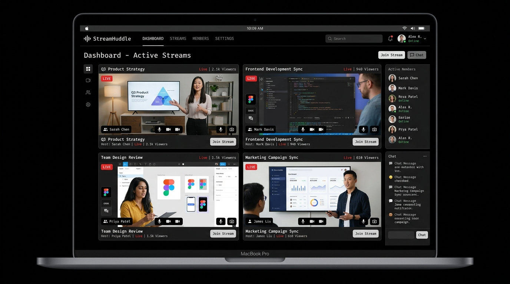

# StreamHuddle



StreamHuddle is the ultimate multi-stream viewing platform—beautifully designed, highly customizable, and built for modern viewers. Watch up to 20 live streams simultaneously across Twitch, YouTube, and Kick with a unified, draggable, and dynamic layout. 

## Features

- **Multi-Streaming Setup**: Seamlessly pull in streams from multiple major platforms like Twitch, YouTube, and Kick in a single window.
- **Draggable & Resizable Grid**: Fully customizable viewing layout. Resize and drag streams into any configuration you want using a beautiful, responsive interface.
- **Universal Chat**: Consolidate chats from all your active streams into one unified sidebar.
- **Sleek, Dark UI**: A modern, premium, dark-themed dashboard focused on performance and aesthetics.

## Tech Stack

StreamHuddle is built on a highly optimized, modern React stack:

- **Frontend**: [TanStack Start](https://tanstack.com/start) + React 19 + TypeScript
- **Backend & Realtime Data**: [Convex](https://convex.dev/)
- **Authentication**: [Better Auth](https://better-auth.com/) (Email/Password, OTP, Google, Twitch)
- **Styling**: Tailwind CSS v4 + [shadcn/ui](https://ui.shadcn.com/)

## Quick Start

### Prerequisites
- Node.js 22.12+ or [Bun](https://bun.sh)
- A [Convex](https://convex.dev) account (free tier)

### Installation

```bash
git clone https://github.com/StreamHuddleHQ/streamhuddle.git
cd streamhuddle
bun install
bun run setup
bun run dev
```

Open [http://localhost:3000](http://localhost:3000) to view the app locally.

## Support

If you enjoy using StreamHuddle, consider supporting the development!

[](https://ko-fi.com/streamhuddle)

## License

This project is licensed under the [GNU Affero General Public License v3.0 (AGPLv3)](LICENSE).
