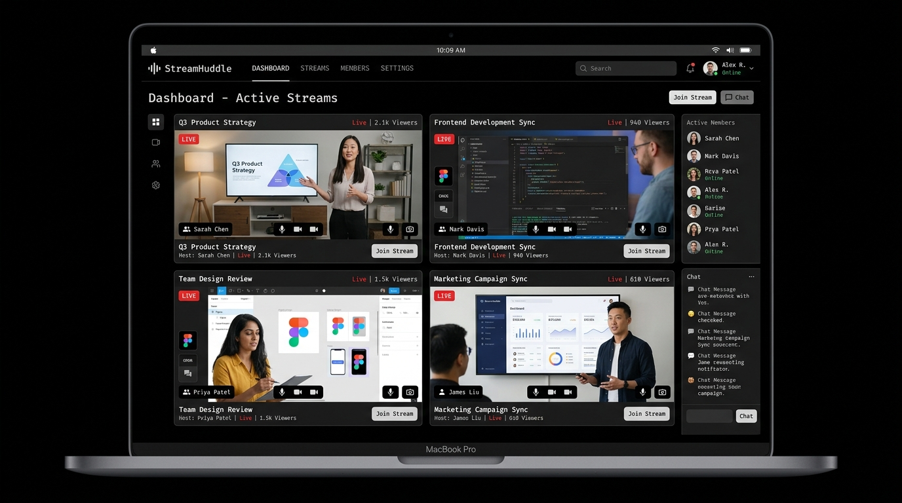

# StreamHuddle



StreamHuddle is the ultimate multi-stream viewing platform—beautifully designed, highly customizable, and built for modern viewers. Watch up to 20 live streams simultaneously across Twitch, YouTube, and Kick with a unified, draggable, and dynamic layout.

## 🚀 Features

### 📺 Viewing Experience
- **Multi-Streaming Setup**: Seamlessly pull in streams from multiple major platforms like Twitch, YouTube, and Kick in a single window.
- **Draggable & Resizable Grid**: Fully customizable viewing layout. Resize and drag streams into any configuration you want using a beautiful, responsive interface.
- **Saved Layouts**: Save your favorite multi-stream setups (e.g. "Night Stream") and instantly load them back.

### 💬 Chat
- **Universal Chat**: Consolidate chats from all your active streams into one unified sidebar.
- **Dynamic Resizing**: Chat windows smartly adjust as you customize your grid.

### ✂️ Clip Queue System (New!)
- **Chat Command Integration**: Viewers can submit clips directly via Twitch chat by typing `!queue <url>`. The invisible `ChatQueueListener` automatically catches these and adds them to the live queue.
- **Real-Time Leaderboard Widget**: A dynamic, live-updating `ClipQueueWidget` on the streamer's profile showing approved clips sorted by upvotes.
- **Upvoting**: Viewers can upvote their favorite clips. Clips from the same URL are automatically deduplicated to pool upvotes together.
- **Global Leaderboard**: The multi-stream squad view aggregates clips across multiple streamers.

### 🎛️ Streamer Tools
- **Streamer Control Panel**: A dedicated interface for streamers to manage their clip queue in real-time. Approve, reject, mark as played, or permanently delete clips.
- **Twitch Integration**: Secure OAuth authentication and token management for fetching high-quality streams and clips.

### 🎨 Design
- **Sleek, Dark UI**: A modern, premium, dark-themed dashboard focused on performance and aesthetics.

---

## 🛠️ Tech Stack

| Category | Technologies |
| --- | --- |
| **Frontend** | [TanStack Start](https://tanstack.com/start), React 19, TypeScript |
| **Backend / Realtime** | [Convex](https://convex.dev/) |
| **Authentication** | [Better Auth](https://better-auth.com/) (Email/Password, OTP, Google, Twitch) |
| **Styling** | Tailwind CSS v4, [shadcn/ui](https://ui.shadcn.com/), Motion (Framer Motion) |
| **Deployment** | Cloudflare Pages |
| **Build** | Vite with custom Node.js build runner |

---

## 🏗️ Architecture Overview

StreamHuddle utilizes a highly optimized, modern architecture:
- **TanStack Start**: Powers the frontend routing and Server-Side Rendering (SSR).
- **Convex**: Provides the backend database and real-time synchronization. Components subscribe to live queries, meaning UI updates (like clip upvotes) propagate instantly to all clients.
- **Cloudflare Pages**: Hosts the frontend application and serverless edge functions.

---

## 🗄️ Database Schema

The backend uses Convex with the following primary tables:

| Table | Description |
| --- | --- |
| `users` | App-specific user data (bio, avatar, role, isPro). Extends Better Auth's identity management. |
| `events` | General containers for tournaments and shows. |
| `creators` | Streamer profiles (Twitch, YouTube, Kick) including live status, viewers, and avatars. |
| `roster` | Junction table mapping creators to specific events. |
| `layouts` | User-saved multi-stream setups (e.g. "Night Stream") and snapshot views. |
| `twitchTokens` | Cached App Access Tokens for Twitch API calls. |
| `clips` | Records of clips being processed, generated, and downloaded via Convex R2 workflow. |
| `twitchUserTokens` | User OAuth tokens required for Twitch integrations. |
| `clipQueue` | Viewer-submitted clips awaiting streamer review or playback. |
| `clipQueueVotes` | Tracks individual user upvotes on clip queue items. |

---

## 🎬 Clip Queue Feature End-to-End

The Clip Queue is a real-time, interactive feature that brings streamers and viewers closer together:
1. **Submission**: A viewer drops a clip link in the streamer's Twitch chat using `!queue <url>`.
2. **Listening**: The `ChatQueueListener.tsx` (using `tmi.js`) intercepts the message client-side and triggers a Convex mutation to add the clip to the queue.
3. **Voting**: Viewers see the clip appear instantly in the `ClipQueueWidget` on the streamer's page. They can click to upvote. Data syncs in real-time across all active viewers.
4. **Moderation**: The streamer uses the `StreamerControlPanel` to review the top clips. They can mark clips as "Played" (removing them from the active list) or delete inappropriate clips.

---

## 🚀 Quick Start

### Prerequisites
- Node.js 22.12+ or [Bun](https://bun.sh)
- A [Convex](https://convex.dev) account (free tier)

### Installation

```bash
git clone https://github.com/StreamHuddleHQ/streamhuddle.git
cd streamhuddle
bun install
bun run setup
bun run dev
```

Open [http://localhost:3000](http://localhost:3000) to view the app locally.

---

## 🔐 Environment Variables

The application requires environment variables defined during the build step and in the Cloudflare deployment.

Required variables in `wrangler.toml` (Build Time):
- `VITE_CONVEX_URL`: The URL to your Convex deployment.
- `VITE_CONVEX_SITE_URL`: The URL to your Convex HTTP site routing.
- `SITE_URL` / `VITE_SITE_URL`: The production URL of the app.

Required variables in Convex (`.env.convex.example` / Convex Dashboard):
- `BETTER_AUTH_SECRET`: Secret used for signing auth tokens.
- `TWITCH_CLIENT_ID` & `TWITCH_CLIENT_SECRET`: For Twitch API integration.
- `RESEND_*`: For email services.

---

## ☁️ Deployment

StreamHuddle is configured to deploy seamlessly to **Cloudflare Pages**. 

### The Build Script Fix (`scripts/build.mjs`)
Deploying a TanStack Start app on Cloudflare Pages requires rendering with Vite. When Vite spins up the prerenderer, it uses the `cloudflare-pages` Nitro preset, spawning a `wrangler pages dev` child process (`workerd`).
Normally, this keeps Node's event loop alive, causing Cloudflare Pages CI builds to hang indefinitely until a 20-minute timeout occurs.
To fix this, we use a custom `scripts/build.mjs` runner that calls Vite's JS API (`build()`). Once the promise resolves, we explicitly call `process.exit(0)` to instantly reap dangling handles and exit cleanly.

```bash
bun run build
# Or deploy using wrangler:
bun run deploy
```

---

## 📂 Project Structure

- `convex/` — Backend logic, real-time database schemas (`schema.ts`), serverless functions (`clipQueue.ts`, `clips.ts`), and workflows.
- `src/components/` — React UI components.
  - `clip-queue/` — Dedicated components for the clip queue feature (`ChatQueueListener.tsx`, `ClipQueueWidget.tsx`, `StreamerControlPanel.tsx`).
- `src/routes/` — TanStack Start file-based routing. Includes core pages like `streamer.$username.tsx`.
- `scripts/` — Build and setup scripts.

---

## 💖 Support

If you enjoy using StreamHuddle, consider supporting the development!

[](https://ko-fi.com/streamhuddle)

---

## 📄 License

This project is licensed under the [GNU Affero General Public License v3.0 (AGPLv3)](LICENSE).
